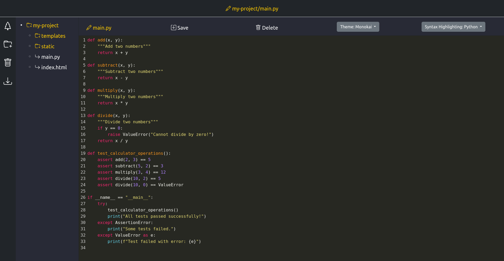

# Django CodeMirror IDE App

This Django app provides an Integrated Development Environment (IDE) with all the basic functions needed for efficient
coding. It allows you to manage files and folders within a project, including saving, renaming, and organizing them in a
project tree. You can download the entire project for offline access and collaborate with others seamlessly. The IDE
also offers auto syntax highlighting and supports multiple themes for a personalized coding experience.

## Screenshots

| OverView                                            | 
|-----------------------------------------------------|
|  | 

## Requirements

- Django
- CodeMirror API
- Bootstrap API

## Installation

1. Clone this repository.
2. Install the required dependencies using pip:

```bash
pip install -r requirements.txt
```

## Usage

1. Ensure your Django project is set up.
2. Add 'ide' to the INSTALLED_APPS list in your Django project settings.
3. Include the URLs from the IDE app in your project's urls.py.
4. Run migrations to create necessary database tables:

```bash
python manage.py makemigrations
python manage.py migrate
```

5. Build the Docker Image:
```bash
sudo docker build -t terminal_session .
```
- You can remove the docker image as follows: 
```bash
docker rmi -f terminal_session
```

6. Add User to Docker Group and set permissions:
```bash
sudo usermod -aG docker your_username
sudo chmod 666 /var/run/docker.sock
```

7. Start your Django development server:
```bash
python manage.py runserver
```

8. Navigate to the IDE app's URL in your browser to access the IDE.
   `http:127.0.0.1:8000`

### Functionality
- Project Management: Create, edit, rename, and organize files and folders within the project tree.
- Download Project: Download the entire project for offline access or sharing with others.
- Auto Syntax Highlighting: Automatically highlight syntax for various programming languages for improved readability.
- Multiple Themes: Choose from a variety of themes to personalize your coding environment.