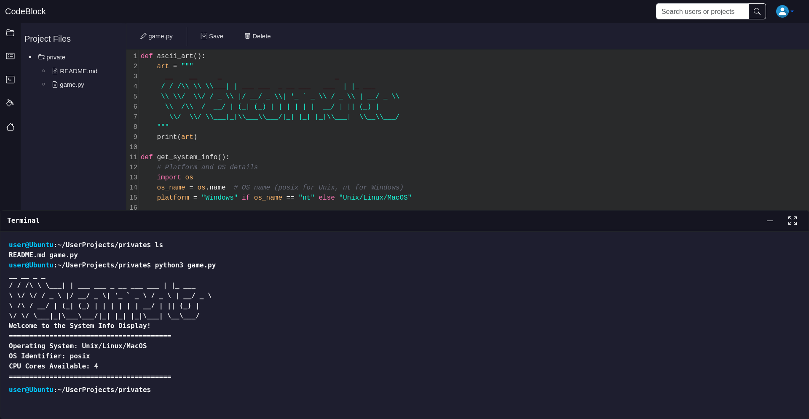

# Django Collaborative Project Platform with IDE and Docker Integration

 This Django-based app combines an Integrated Development Environment (IDE) with social and collaborative features. It enables users to connect, collaborate on projects, manage tasks, and even run project code in a Docker terminal. 

## Key Features

### Social and Messaging:
- **Direct Messaging:** Send direct messages to users you follow and who follow you.
- **User Connections:** Follow other users and see who follows you to build a collaborative network.
- **Project Browsing:** View and explore other users' public projects.

### Collaboration and Task Management:
- **Project Collaboration:** Collaborate with other users on shared projects.
- **Task Management:** Assign and manage tasks for collaborators within projects.
- **Docker Integration:** Run project code directly in a Docker-based terminal environment.

### IDE Functionality:
- **Project Management:** Create, edit, rename, and organize files and folders within the project tree.
- **Download Project:** Download the entire project for offline access or sharing.
- **Auto Syntax Highlighting:** Syntax highlighting for various programming languages for improved readability.
- **Themes:** Personalize your coding environment with multiple available themes.

## Screenshots

| Overview                                            | 
|-----------------------------------------------------|
|  |

## Requirements

- Django
- CodeMirror API
- Bootstrap API
- Docker

## Step-by-Step Guide: Installing and Setting Up Redis
This guide provides a step-by-step approach to installing and configuring Redis on a Linux server.

### Step 1: Update System Packages
Make sure your system packages are up-to-date.
```bash
sudo apt update
sudo apt upgrade -y
```
### Step 2: Install Redis
Install Redis and its associated tools using the following command:
```bash
sudo apt install redis-server -y
```

### Step 3: Verify Redis Installation
Check the version of Redis to confirm it is installed:
```bash
redis-server --version
```

### Step 4: Enable and Start the Redis Service
Ensure Redis is enabled to start at boot and is running:
```bash
sudo systemctl enable redis-server
sudo systemctl start redis-server
```
Verify the status:
```bash
sudo systemctl status redis-server
```

### Step 5: Test Redis Locally
Check if Redis is running by using the ping command:
```bash
redis-cli ping
```
If successful, you should see the response:
```bash
PONG
```

### Step 6: Open Port 6379 in Firewall
Allow external connections to Redis by opening port 6379:
```bash
sudo ufw allow 6379
```

### Step 7: Clone this repository.
```bash
   git clone https://github.com/your-repo/project-platform.git
   cd project-platform
```

### Step 8: Install the required dependencies using pip:
```bash
pip install -r requirements.txt
```
### Step 9: Run migrations to create necessary database tables:
```bash
python manage.py makemigrations
python manage.py migrate
```

### Step 10: Build the Docker image for running project code:
```bash
sudo docker build -t terminal_session .
```
- To remove the Docker image: 
```bash
sudo docker rmi -f terminal_session
```

### Step 11: Start your Django development server:


```bash
python manage.py runserver
```

For WebSocket functionality, run the ASGI server:
```bash
daphne -p 8000 core.asgi:application
```
to run without local host: 
```bash
daphne -b 0.0.0.0 -p 8000 core.asgi:application
```
run without local host and prevent server timeouts etc: 
```bash
nohup daphne -b 0.0.0.0 -p 8000 core.asgi:application &
```


## Functionality
- Messaging and Networking: Build a network of collaborators and communicate seamlessly.
- Project Collaboration: Work with team members on shared projects, assign tasks, and track progress.
- IDE with Docker Support: Write, manage, and run project code with the integrated IDE and Docker terminal.